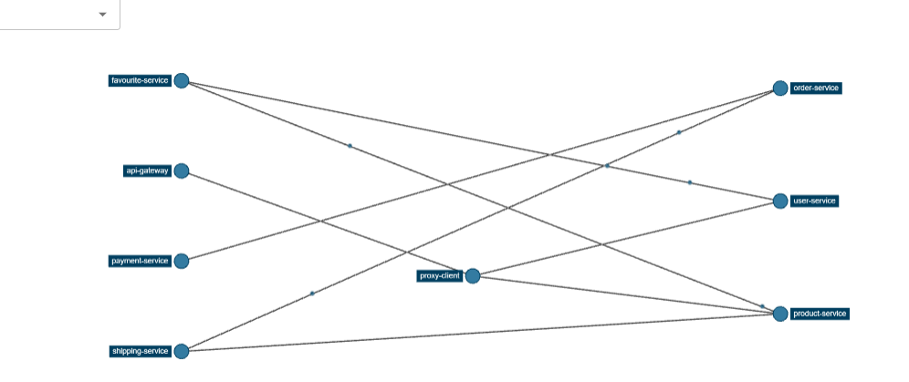

Para correr el compose

0. Clonar el repositorio y pararte en la raiz

1. Dividir el compose en `core.yml` y `compose.yml`

- en el primer archivo `core.yml` pondremos los servicios de los cuales todos los demás dependen

  - `zipkin`

  - `service-discovery-container`

  - `cloud-config-container`

- Además vamos a poner a todos los contenedores en la misma red `microservices_network`

- Por último vamos a agregar en `cloud-config-container` las variables

      - SPRING_ZIPKIN_BASE-URL=http://zipkin:9411
      - EUREKA_CLIENT_REGION=default
      - EUREKA_CLIENT_AVAILABILITYZONES_DEFAULT=myzone
      - EUREKA_CLIENT_SERVICEURL_MYZONE=http://service-discovery-container:8761/eureka
      - EUREKA_CLIENT_SERVICEURL_DEFAULTZONE=http://service-discovery-container:8761/eureka/
 
    Y en service-discovery-container

      - SPRING_ZIPKIN_BASE-URL=http://zipkin:9411
      - SPRING_CONFIG_IMPORT=optional:configserver:http://cloud-config-container:9296/

    Esto para que los contenedores tengan referencia del contenedor de zipkin y de cloud-config dentro de la red y no lo tomen como que esta corriendo en localhost

```yml
version: '3'
services:
  zipkin:
    image: openzipkin/zipkin
    ports:
      - 9411:9411
    networks:
      - microservices_network
  service-discovery-container:
    image: selimhorri/service-discovery-ecommerce-boot:0.1.0
    ports:
      - 8761:8761
    networks:
      - microservices_network
    environment:
      - SPRING_PROFILES_ACTIVE=dev
      - SPRING_ZIPKIN_BASE-URL=http://zipkin:9411
      - EUREKA_CLIENT_REGION=default
      - EUREKA_CLIENT_AVAILABILITYZONES_DEFAULT=myzone
      - EUREKA_CLIENT_SERVICEURL_MYZONE=http://service-discovery-container:8761/eureka
      - EUREKA_CLIENT_SERVICEURL_DEFAULTZONE=http://service-discovery-container:8761/eureka/

  cloud-config-container:
    image: selimhorri/cloud-config-ecommerce-boot:0.1.0
    ports:
      - 9296:9296
    networks:
      - microservices_network
    environment:
      - SPRING_PROFILES_ACTIVE=dev
      - SPRING_ZIPKIN_BASE-URL=http://zipkin:9411
      - SPRING_CONFIG_IMPORT=optional:configserver:http://cloud-config-container:9296/

networks:
  microservices_network:
    driver: bridge
```

Ahora podemos levantar estos servicios con

```sh
docker-compose -f core.yml up -d
```

2. Luego en el `compose.yml` que ya teniamos, vamos a eliminar los servicios que agregamos en `core.yml`, es decir, 

  - `zipkin`

  - `service-discovery-container`

  - `cloud-config-container`

- Luego vamos a agregarlos todos a la misma red anterior `microservices_network`

- Por ultimo agregamos las siguientes variables de entorno a todos los contenedores

```
      - SPRING_ZIPKIN_BASE-URL=http://zipkin:9411
      - EUREKA_CLIENT_REGION=default
      - EUREKA_CLIENT_AVAILABILITYZONES_DEFAULT=myzone
      - EUREKA_CLIENT_SERVICEURL_MYZONE=http://service-discovery-container:8761/eureka
      - EUREKA_CLIENT_SERVICEURL_DEFAULTZONE=http://service-discovery-container:8761/eureka/
      - SPRING_CONFIG_IMPORT=optional:configserver:http://cloud-config-container:9296/
```

Nos debe quedar así
```yml
version: '3'
services:
  api-gateway-container:
    image: selimhorri/api-gateway-ecommerce-boot:0.1.0
    ports:
      - 8080:8080
    networks:
      - microservices_network
    environment:
      - SPRING_PROFILES_ACTIVE=dev
      - SPRING_ZIPKIN_BASE-URL=http://zipkin:9411
      - SPRING_CONFIG_IMPORT=optional:configserver:http://cloud-config-container:9296/
      - EUREKA_CLIENT_REGION=default
      - EUREKA_CLIENT_AVAILABILITYZONES_DEFAULT=myzone
      - EUREKA_CLIENT_SERVICEURL_MYZONE=http://service-discovery-container:8761/eureka
      - EUREKA_CLIENT_SERVICEURL_DEFAULTZONE=http://service-discovery-container:8761/eureka/

  proxy-client-container:
    image: selimhorri/proxy-client-ecommerce-boot:0.1.0
    ports:
      - 8900:8900
    networks:
      - microservices_network
    environment:
      - SPRING_PROFILES_ACTIVE=dev
      - SPRING_ZIPKIN_BASE-URL=http://zipkin:9411
      - EUREKA_CLIENT_REGION=default
      - EUREKA_CLIENT_AVAILABILITYZONES_DEFAULT=myzone
      - EUREKA_CLIENT_SERVICEURL_MYZONE=http://service-discovery-container:8761/eureka
      - EUREKA_CLIENT_SERVICEURL_DEFAULTZONE=http://service-discovery-container:8761/eureka/
      - SPRING_CONFIG_IMPORT=optional:configserver:http://cloud-config-container:9296/

  order-service-container:
    image: selimhorri/order-service-ecommerce-boot:0.1.0
    ports:
      - 8300:8300
    networks:
      - microservices_network
    environment:
      - SPRING_PROFILES_ACTIVE=dev
      - SPRING_ZIPKIN_BASE-URL=http://zipkin:9411
      - EUREKA_CLIENT_REGION=default
      - EUREKA_CLIENT_AVAILABILITYZONES_DEFAULT=myzone
      - EUREKA_CLIENT_SERVICEURL_MYZONE=http://service-discovery-container:8761/eureka
      - EUREKA_CLIENT_SERVICEURL_DEFAULTZONE=http://service-discovery-container:8761/eureka/
      - SPRING_CONFIG_IMPORT=optional:configserver:http://cloud-config-container:9296/

  payment-service-container:
    image: selimhorri/payment-service-ecommerce-boot:0.1.0
    ports:
      - 8400:8400
    networks:
      - microservices_network
    environment:
      - SPRING_PROFILES_ACTIVE=dev
      - SPRING_ZIPKIN_BASE-URL=http://zipkin:9411
      - EUREKA_CLIENT_REGION=default
      - EUREKA_CLIENT_AVAILABILITYZONES_DEFAULT=myzone
      - EUREKA_CLIENT_SERVICEURL_MYZONE=http://service-discovery-container:8761/eureka
      - EUREKA_CLIENT_SERVICEURL_DEFAULTZONE=http://service-discovery-container:8761/eureka/
      - SPRING_CONFIG_IMPORT=optional:configserver:http://cloud-config-container:9296/

  product-service-container:
    image: selimhorri/product-service-ecommerce-boot:0.1.0
    ports:
      - 8500:8500
    networks:
      - microservices_network
    environment:
      - SPRING_PROFILES_ACTIVE=dev
      - EUREKA_CLIENT_REGION=default
      - EUREKA_CLIENT_AVAILABILITYZONES_DEFAULT=myzone
      - EUREKA_CLIENT_SERVICEURL_MYZONE=http://service-discovery-container:8761/eureka
      - EUREKA_CLIENT_SERVICEURL_DEFAULTZONE=http://service-discovery-container:8761/eureka/
      - SPRING_ZIPKIN_BASE-URL=http://zipkin:9411
      - SPRING_CONFIG_IMPORT=optional:configserver:http://cloud-config-container:9296/

  shipping-service-container:
    image: selimhorri/shipping-service-ecommerce-boot:0.1.0
    networks:
      - microservices_network
    ports:
      - 8600:8600
    environment:
      - SPRING_PROFILES_ACTIVE=dev
      - SPRING_CONFIG_IMPORT=optional:configserver:http://cloud-config-container:9296/
      - SPRING_ZIPKIN_BASE-URL=http://zipkin:9411
      - EUREKA_CLIENT_REGION=default
      - EUREKA_CLIENT_AVAILABILITYZONES_DEFAULT=myzone
      - EUREKA_CLIENT_SERVICEURL_MYZONE=http://service-discovery-container:8761/eureka
      - EUREKA_CLIENT_SERVICEURL_DEFAULTZONE=http://service-discovery-container:8761/eureka/
 
  user-service-container:
    image: selimhorri/user-service-ecommerce-boot:0.1.0
    ports:
      - 8700:8700
    networks:
      - microservices_network
    environment:
      - SPRING_PROFILES_ACTIVE=dev
      - SPRING_ZIPKIN_BASE-URL=http://zipkin:9411
      - EUREKA_CLIENT_REGION=default
      - EUREKA_CLIENT_AVAILABILITYZONES_DEFAULT=myzone
      - EUREKA_CLIENT_SERVICEURL_MYZONE=http://service-discovery-container:8761/eureka
      - EUREKA_CLIENT_SERVICEURL_DEFAULTZONE=http://service-discovery-container:8761/eureka/
      - SPRING_CONFIG_IMPORT=optional:configserver:http://cloud-config-container:9296/

  favourite-service-container:
    image: selimhorri/favourite-service-ecommerce-boot:0.1.0
    ports:
      - 8800:8800
    networks:
      - microservices_network
    environment:
      - SPRING_PROFILES_ACTIVE=dev
      - SPRING_ZIPKIN_BASE-URL=http://zipkin:9411
      - EUREKA_CLIENT_REGION=default
      - EUREKA_CLIENT_AVAILABILITYZONES_DEFAULT=myzone
      - EUREKA_CLIENT_SERVICEURL_MYZONE=http://service-discovery-container:8761/eureka
      - EUREKA_CLIENT_SERVICEURL_DEFAULTZONE=http://service-discovery-container:8761/eureka/
      - SPRING_CONFIG_IMPORT=optional:configserver:http://cloud-config-container:9296/

networks:
  microservices_network:
    driver: bridge
```

Antes de levantar estos servicios, tenemoss que esperar que los servicios de `core.yml` se hayan de iniciar completamente, no solo de levantar, si no, que esten disponibles para recibir peticiones, esto podemos verlo en los logs de los contenedores con

```sh
docker logs <id-del-contenedor>
```

Para `api-gateway` se deben ver logs así:

```
2025-05-21 15:25:57 2025-05-21 20:25:57.341 DEBUG [API-GATEWAY,,] 1 --- [tbeatExecutor-0] o.s.web.client.RestTemplate              : Response 200 OK
2025-05-21 15:25:58 2025-05-21 20:25:58.836 DEBUG [API-GATEWAY,,] 1 --- [freshExecutor-0] o.s.web.client.RestTemplate              : HTTP GET http://service-discovery-container:8761/eureka/apps/delta
```

para `service-discovery`

```
2025-05-21 14:02:40 2025-05-21 19:02:40.352  INFO [SERVICE-DISCOVERY,,] 1 --- [           main] c.n.e.registry.AbstractInstanceRegistry  : Finished initializing remote region registries. All known remote regions: []
```

Cuando veas esos logs ya puedes levantar los demás servicios con 

```sh
docker-compose up -d
```

Una vez levantados, puedes probar los servicios en estos endpoints

http://localhost:8080/app/api/products

http://localhost:8600/shipping-service/api/shippings

http://localhost:8700/user-service/api/users

http://localhost:8500/product-service/api/products

http://localhost:8800/favourite-service/api/favourites

http://localhost:8400/payment-service/api/payments

También pueden crear un usuario:

POST `http://localhost:8700/user-service/api/users`

```
{
    "userId": "{{$randomInt}}",
    "firstName": "Alejandro",
    "lastName": "Cordoba",
    "imageUrl": "{{$randomUrl}}",
    "email": "{{$randomEmail}}",
    "addressDtos": [
        {
            "fullAddress": "123 Main St",
            "postalCode": "12345",
            "city": "New York"
        }
    ],
    "credential": {
        "username": "johndoe",
        "password": "securePassword123",
        "roleBasedAuthority": "ROLE_USER",
        "isEnabled": true,
        "isAccountNonExpired": true,
        "isAccountNonLocked": true,
        "isCredentialsNonExpired": true
    }
}
```

Y con esto ya pueden continuar explorando los endpoints de los servicios

### Vista de dependencias en Zipkin

